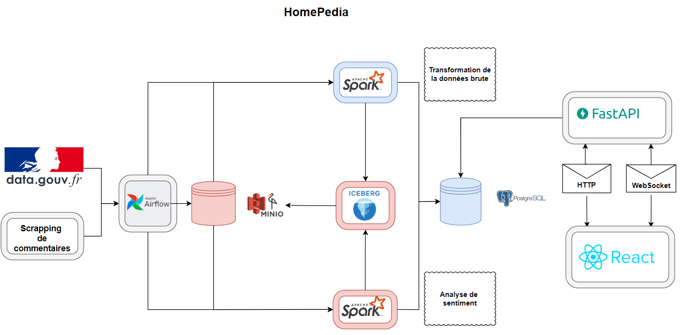

# 🏠 ImmoScope - Plateforme Interactive d'Analyse Immobilière



Une plateforme cartographique interactive pour l'analyse de données immobilières avec analyse de sentiment sur les commentaires de propriétés. Construite avec des technologies modernes d'ingénierie de données et web.

## ✨ Fonctionnalités
- 🕷️ Scraping en temps réel de données immobilières depuis LogicImmo et LeBonCoin
- ⚡ Pipeline de transformation de données avec Apache Spark
- 💭 Analyse de sentiment sur les avis immobiliers et commentaires citoyens
- 🗺️ Visualisation cartographique interactive basée sur React/Leaflet
- 🔄 Mises à jour temps réel via WebSocket
- 💾 Stockage géré avec MinIO (compatible S3)
- ⚡ Gestion de cache avec Redis

## 🛠️ Technologies
| Composant | Technologie | Objectif |
|-----------|------------|----------|
| 🎯 Orchestration Data | Apache Spark | Traitement ETL et jobs d'analytics |
| 📦 Stockage | MinIO | Stockage données brutes/traitées |
| ⚡ Traitement Données | Apache Spark | Jobs ETL et analytics distribués |
| 🚀 API Backend | FastAPI | Endpoints REST et WebSocket |
| 🐘 Base de données | PostgreSQL | Stockage de données structurées |
| 🔥 Cache | Redis | Cache haute performance |
| 🎨 Frontend | Next.js/React | Interface cartographique interactive |
| 🔍 Recherche | Elasticsearch | Indexation et recherche de commentaires |
| 📊 Visualisation | Kibana | Dashboards d'analytics |

---

## 🚀 Démarrage Rapide

### 📋 Prérequis
- 🐳 Docker 20.10+
- 🔧 Docker Compose 2.20+
- 💾 8GB+ RAM (Spark/Elasticsearch nécessitent des ressources)

### ⚙️ Configuration Docker Compose

```bash
# 📥 Cloner le dépôt
git clone git@github.com:EpitechMscProPromo2025/ImmoScope.git
cd ImmoScope

# 📄 Copier le fichier d'environnement
cp ".env copy.example" .env

# 🚀 Démarrer les services
make start
# ou directement : docker compose up -d --build
```

### 🗄️ Initialisation de la base de données
```bash
# 📊 Importer le dump SQL initial (1.9GB)
make build-data
```

---

## 📁 Structure du Projet
```
ImmoScope/
├── 🌐 api/                 # API Backend FastAPI principale
│   ├── 🔐 auth/           # Système d'authentification JWT
│   ├── 🛣️ routes/         # Endpoints API (data, proprietes, auth, cache)
│   ├── ⚙️ services/       # Logique métier et services
│   ├── 🗄️ db/             # Modèles SQLAlchemy
│   └── 🕷️ scraping/       # Scripts de collecte LogicImmo/LeBonCoin
├── 🗺️ api_maillage/       # API géographique pour maillage territorial
├── 🎨 frontend/           # Interface Next.js avec carte Leaflet
│   ├── 📱 app/           # Pages et composants React
│   ├── 🔌 api/           # Services API TypeScript
│   └── 🗃️ store/         # État Redux global
├── ⚡ spark-jobs/         # Jobs de traitement Big Data
│   ├── 🏠 transform_html_data.py    # ETL annonces immobilières
│   ├── 💬 transform_comment.py      # ETL commentaires citoyens
│   ├── 🧠 nlp.py                    # Analyse sentiment NLP
│   └── 🎯 run.py                    # Orchestrateur des jobs
├── 🐳 docker/             # Configurations Docker
├── 🗄️ initdb/             # Scripts d'initialisation DB
├── 📝 Makefile           # Commandes de construction et d'exécution
└── 🔧 docker-compose.yml # Orchestration des services
```

## 🎮 Commandes Principales

### 🌐 Accès aux services :
- **🎯 Frontend Principal** : http://localhost:3001 (Interface cartographique)
- **🚀 API Backend** : http://localhost:82 (API FastAPI principale)
- **🗺️ API Maillage** : http://localhost:81 (API géographique)
- **⚡ Spark UI** : http://localhost:8080 (Monitoring des jobs)
- **📦 MinIO Console** : http://localhost:9001 (minioadmin/minioadmin123)
- **🐘 pgAdmin** : http://localhost:5050 (admin@admin.com/admin123)
- **📊 Kibana** : http://localhost:5601 (Analytics Elasticsearch)

### ⚡ Exécuter les jobs Spark :
```bash
# 🏠 Traitement des annonces immobilières
make spark-immo
# ou : docker compose run spark-job logic-immo

# 💬 Traitement des commentaires citoyens
make spark-comment
# ou : docker compose run spark-job comment

# 🧠 Analyse de sentiment NLP
docker compose run spark-job nlp

# 🧪 Tests de connectivité Spark
make spark-test
```

### 🎛️ Commandes de gestion :
```bash
# ▶️ Démarrer tous les services
make start

# ⏹️ Arrêter les services
make stop

# 🔄 Redémarrage complet (supprime les volumes)
make reload
```

## 🔌 API Endpoints Principaux

### 📊 API Données (`/data`)
```bash
# 🏘️ Données complètes d'une commune
GET /data/commune/{code}/all?niveau=commune

# 🛡️ Réputations/sécurité par zone
GET /data/reputations/chart?code=69123&niveau=commune

# 🏢 Équipements publics
GET /data/equipements?code=69123

# 🏡 Données foncières/transactions
GET /data/fonciers?code=69123&niveau=commune
```

### 🗺️ API Maillage Géographique (`/maille`)
```bash
# 📍 Informations d'une commune
GET /maille/commune/69123

# 🏙️ Communes d'un département
GET /maille/enfants/departement/69

# 🔍 Recherche par nom
GET /search?q=Villeurbanne&niveau=commune
```

### 👤 API Authentification (`/user`)
```bash
# ✍️ Inscription
POST /user/signup

# 🔑 Connexion
POST /user/login

# 👤 Profil utilisateur
GET /user/me
```

## 🔄 Pipeline de Données Spark

### 1️⃣ Collecte (Scraping)
- **📡 Sources** : LogicImmo, LeBonCoin, commentaires citoyens
- **💾 Stockage** : Fichiers HTML dans MinIO (buckets `web-scraping`, `comment`)

### 2️⃣ Transformation (Spark Jobs)
- **🏠 `transform_html_data.py`** : Parse HTML → extraction prix, surface, ville
- **💬 `transform_comment.py`** : Extraction commentaires → sentiment de base
- **🧠 `nlp.py`** : Analyse sentiment avancée (FR→EN→scoring)

### 3️⃣ Persistance
- **🐘 PostgreSQL** : Données structurées (propriétés, utilisateurs)
- **🔍 Elasticsearch** : Index commentaires avec sentiment
- **⚡ Redis** : Cache des requêtes fréquentes

## 🌍 Variables d'Environnement

Configurez le fichier `.env` :

```bash
# 🐘 Base de données PostgreSQL
POSTGRES_USER=trainuser
POSTGRES_PASSWORD=trainpass123
POSTGRES_DB=traindb

# ⚡ Cache Redis
REDIS_PASSWORD=redis123

# 📦 Stockage MinIO
MINIO_ROOT_USER=minioadmin
MINIO_ROOT_PASSWORD=minioadmin123

# 🔍 Elasticsearch/Kibana
ELASTICSEARCH_USERNAME=kibana_system
ELASTICSEARCH_PASSWORD=password123

# 🚀 API Configuration
ACCESS_TOKEN_EXPIRE_SECONDES=3600
API_PORT=82
```

## 🏗️ Architecture des Données

### 🔄 Flux Principal
1. **🕷️ Scraping** → Collecte HTML (sites immobiliers)
2. **📦 MinIO** → Stockage fichiers bruts
3. **⚡ Spark** → Transformation et nettoyage
4. **🐘 PostgreSQL** → Données structurées
5. **🔍 Elasticsearch** → Index commentaires
6. **⚡ Redis** → Cache optimisé
7. **🚀 APIs** → Exposition des données
8. **🎨 Frontend** → Visualisation cartographique

### 📊 Types de Données
- **🏠 Propriétés immobilières** : Prix, surface, localisation, prix/m²
- **💬 Commentaires citoyens** : Avis quartiers, sentiment, géolocalisation
- **📋 Données foncières** : Transactions officielles, mutations
- **🏢 Équipements publics** : Services, infrastructure locale
- **🗺️ Maillage territorial** : Découpage administratif (commune/département/région)

## 📚 Documentation API

- **📖 Swagger UI** : http://localhost:82/docs (Documentation interactive)
- **📄 ReDoc** : http://localhost:82/redoc (Documentation alternative)
- **📮 Collection Postman** : [Documentation API détaillée](https://documenter.getpostman.com/view/13153597/2sAYkGKeU7)

## 🔧 Dépannage

### ⚠️ Problèmes courants
- **🎨 Frontend ne s'affiche pas** : Vérifiez le port 3001 (et non 3000)
- **💾 Erreurs Spark OOM** : Augmentez la RAM Docker ou réduisez `SPARK_WORKER_MEMORY`
- **🗄️ Base de données vide** : Exécutez `make build-data` pour importer le dump
- **⚡ Cache lent** : Videz le cache Redis via `/cache/clear`

### 📝 Logs utiles
```bash
# 📊 Logs des services
docker compose logs frontend
docker compose logs api
docker compose logs spark-master
docker compose logs postgres

# 📋 Statut des conteneurs
docker ps
```

## 🤝 Contribuer

1. 🍴 Fork du projet
2. 🌿 Créer une branche feature : `git checkout -b feature/nouvelle-fonctionnalite`
3. 💾 Commit des changements : `git commit -m 'Ajout nouvelle fonctionnalité'`
4. 📤 Push vers la branche : `git push origin feature/nouvelle-fonctionnalite`
5. 🔀 Ouvrir une Pull Request

---

*🏠 Développé avec ❤️ par l'équipe ImmoScope - Projet d'analyse immobilière et de données géographiques*
